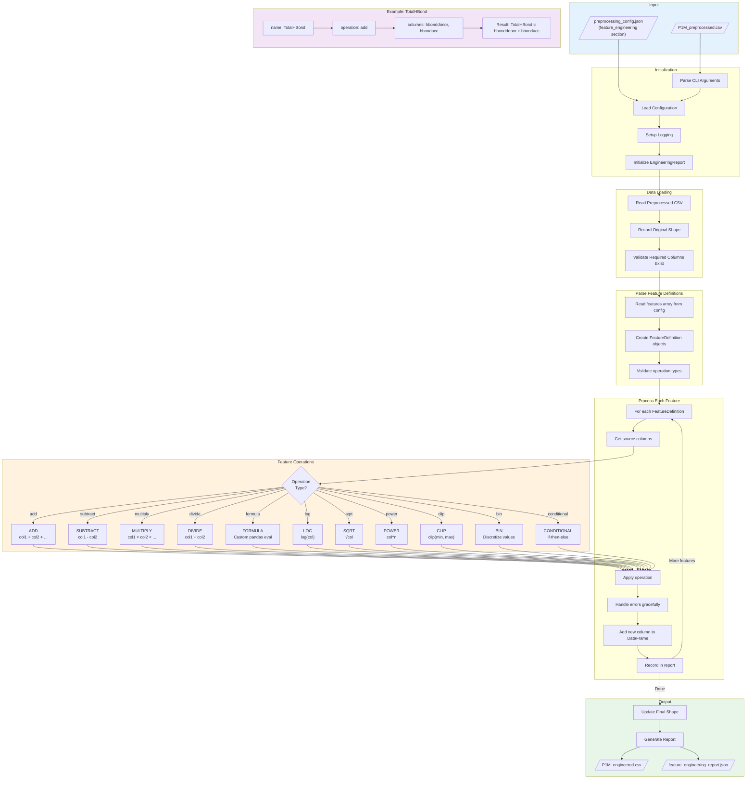
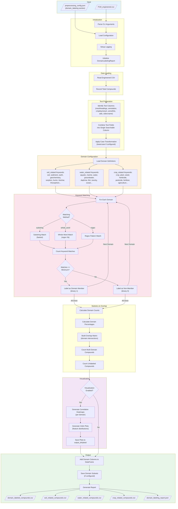
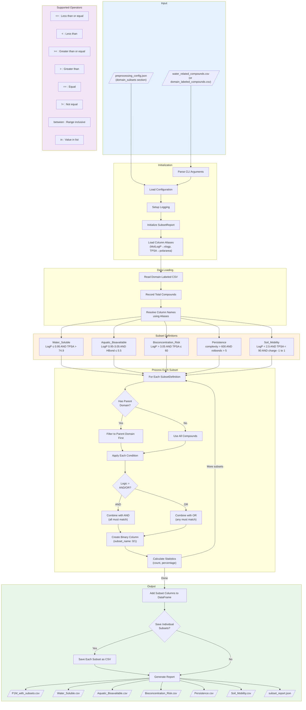
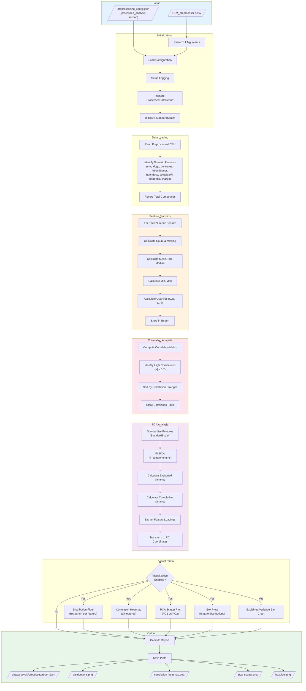

# PHORCE Pipeline Flow Diagram

```mermaid
flowchart TB
    subgraph Input["Input"]
        RAW[("P1M.csv<br/>Raw Data<br/>1M compounds")]
        CONFIG[/"preprocessing_config.json"/]
    end

    subgraph Preprocessing["Step 1: Data Preprocessing"]
        direction TB
        P1["Standardize Missing Values<br/>(NA, null, None → NaN)"]
        P2["Drop/Keep Specified Columns<br/>(37 columns kept)"]
        P3["Drop High-Missing Columns<br/>(threshold: 95%)"]
        P4["Drop High-Missing Rows<br/>(threshold: 50%)"]
        P5["Drop Rows Missing Required<br/>(cid, canonicalsmiles, meshheadings)"]
        P6["Drop Rows with Missing<br/>Numeric Values"]
        P7["Remove Duplicates"]
        P8["Clean Text Columns<br/>(strip whitespace)"]
        P9["Clean Numeric Columns<br/>(remove negatives)"]
        P10["Enforce Data Types<br/>(int/float/string)"]
        
        P1 --> P2 --> P3 --> P4 --> P5 --> P6 --> P7 --> P8 --> P9 --> P10
    end

    subgraph FeatureEng["Step 2: Feature Engineering"]
        FE1["Load Preprocessed Data"]
        FE2["Create TotalHBond Feature<br/>(hbonddonor + hbondacc)"]
        FE3["Save Engineered Dataset"]
        
        FE1 --> FE2 --> FE3
    end

    subgraph DomainLabeling["Step 3: Domain Labeling"]
        direction TB
        DL1["Load Engineered Data"]
        DL2["Search Text Columns<br/>(meshheadings, annotation,<br/>cmpdsynonym, annothits)"]
        
        subgraph Domains["Domain Classification"]
            D1["soil_related<br/>(soil, sediment, humic...)"]
            D2["water_related<br/>(aquatic, marine, daphnia...)"]
            D3["crop_related<br/>(crop, herbicide, pesticide...)"]
        end
        
        DL3["Create Domain Labels<br/>(binary columns)"]
        DL4["Generate Visualizations<br/>(heatmaps, violin plots)"]
        
        DL1 --> DL2 --> Domains --> DL3 --> DL4
    end

    subgraph SubsetCreation["Step 4: Subset Creation"]
        direction TB
        SC1["Load Domain-Labeled Data"]
        
        subgraph Subsets["Chemical Subsets"]
            S1["Water_Soluble<br/>(LogP ≤ 0.95, TPSA > 74.9)"]
            S2["Aquatic_Bioavailable<br/>(LogP 0.95-3.05, HBond ≤ 5.5)"]
            S3["Bioconcentration_Risk<br/>(LogP > 3.05, TPSA ≤ 60)"]
            S4["Persistence<br/>(complexity > 600, rotbonds > 5)"]
            S5["Soil_Mobility<br/>(LogP < 2.5, TPSA < 90)"]
        end
        
        SC2["Apply Filters &<br/>Create Subset Columns"]
        SC3["Save Individual Subset Files"]
        
        SC1 --> Subsets --> SC2 --> SC3
    end

    subgraph Analysis["Step 5: Analysis"]
        direction TB
        
        subgraph ProcessedAnalysis["Processed Data Analysis"]
            PA1["Distribution Plots"]
            PA2["Correlation Heatmap"]
            PA3["PCA Analysis<br/>(5 components)"]
            PA4["Box Plots"]
        end
        
        subgraph DomainAnalysis["Domain Analysis"]
            DA1["Train Decision Trees<br/>(per domain)"]
            DA2["Cross-Validation<br/>(5-fold)"]
            DA3["Feature Importance"]
            DA4["Rule Extraction"]
            DA5["Similarity Analysis"]
            DA6["ROC Curves"]
        end
        
        subgraph SubdomainAnalysis["Subdomain Analysis"]
            SA1["Train Decision Trees<br/>(per subset)"]
            SA2["Cross-Validation<br/>(5-fold)"]
            SA3["Feature Importance"]
            SA4["Rule Extraction"]
            SA5["Confusion Matrices"]
            SA6["PCA Visualization"]
        end
    end

    subgraph Outputs["Outputs"]
        direction TB
        O1[("data/processed/<br/>P1M_preprocessed.csv")]
        O2[("data/engineered/<br/>P1M_engineered.csv")]
        O3[("data/labeled/<br/>domain_labeled_compounds.csv")]
        O4[("data/subsets/<br/>Individual subset CSVs")]
        O5[/"Reports (JSON)"/]
        O6[/"Visualizations (PNG)"/]
    end

    %% Main Flow
    RAW --> Preprocessing
    CONFIG -.-> Preprocessing
    CONFIG -.-> FeatureEng
    CONFIG -.-> DomainLabeling
    CONFIG -.-> SubsetCreation
    CONFIG -.-> Analysis
    
    Preprocessing --> O1
    O1 --> FeatureEng
    FeatureEng --> O2
    O2 --> DomainLabeling
    DomainLabeling --> O3
    O3 --> SubsetCreation
    SubsetCreation --> O4
    
    O1 --> ProcessedAnalysis
    O3 --> DomainAnalysis
    O4 --> SubdomainAnalysis
    
    ProcessedAnalysis --> O5
    ProcessedAnalysis --> O6
    DomainAnalysis --> O5
    DomainAnalysis --> O6
    SubdomainAnalysis --> O5
    SubdomainAnalysis --> O6

    %% Styling
    classDef input fill:#e1f5fe,stroke:#01579b,stroke-width:2px
    classDef process fill:#fff3e0,stroke:#e65100,stroke-width:2px
    classDef analysis fill:#f3e5f5,stroke:#7b1fa2,stroke-width:2px
    classDef output fill:#e8f5e9,stroke:#2e7d32,stroke-width:2px
    classDef config fill:#fce4ec,stroke:#c2185b,stroke-width:2px
    
    class RAW input
    class CONFIG config
    class O1,O2,O3,O4,O5,O6 output
```

---

## Individual Script Flowcharts

### 1. preprocess_data.py

```mermaid
flowchart TD
    subgraph Input["Input"]
        A1[/"P1M.csv"/]
        A2[/"preprocessing_config.json"/]
    end

    subgraph Init["Initialization"]
        B1["Parse CLI Arguments"]
        B2["Load Configuration"]
        B3["Setup Logging"]
        B4["Initialize Preprocessing Report"]
    end

    subgraph Load["Data Loading"]
        C1["Read CSV File"]
        C2["Record Initial Shape<br/>(rows, columns)"]
    end

    subgraph MissingValues["Missing Value Handling"]
        D1["Standardize Missing Values<br/>(NA, null, None, ., -, ? → NaN)"]
        D2{"Columns with<br/>>95% Missing?"}
        D3["Drop High-Missing Columns"]
        D4{"Rows with<br/>>50% Missing?"}
        D5["Drop High-Missing Rows"]
        D6{"Required Columns<br/>Missing?"}
        D7["Drop Rows Missing Required"]
        D8{"Strategy =<br/>drop_rows?"}
        D9["Drop Rows with Missing<br/>Numeric Values"]
    end

    subgraph ColumnOps["Column Operations"]
        E1["Drop Specified Columns"]
        E2["Keep Only Specified Columns"]
    end

    subgraph Cleaning["Data Cleaning"]
        F1["Remove Duplicates<br/>(optional)"]
        F2["Strip Whitespace<br/>from Text Columns"]
        F3["Remove Negative Values<br/>(mw, polararea, etc.)"]
        F4["Remove Zero Values<br/>(if configured)"]
        F5["Handle Outliers<br/>(if configured)"]
    end

    subgraph Validation["Validation & Types"]
        G1["Validate SMILES<br/>(if RDKit available)"]
        G2["Validate InChI<br/>(if configured)"]
        G3["Enforce Integer Types"]
        G4["Enforce Float Types"]
        G5["Enforce String Types"]
    end

    subgraph FeatureOps["Feature Operations"]
        H1["Remove Constant Columns<br/>(if enabled)"]
        H2["Remove Quasi-Constant Columns<br/>(threshold: 99%)"]
        H3["Remove Highly Correlated<br/>(if enabled)"]
        H4["Apply Value Filters<br/>(MW, LogP ranges)"]
    end

    subgraph Output["Output"]
        I1["Compute Column Statistics"]
        I2["Generate Report"]
        I3[/"P1M_preprocessed.csv"/]
        I4[/"preprocessing_report.json"/]
        I5[/"preprocessing.log"/]
    end

    A1 --> B1
    A2 --> B2
    B1 --> B2 --> B3 --> B4 --> C1
    C1 --> C2 --> D1
    
    D1 --> E1 --> E2 --> D2
    D2 -->|Yes| D3 --> D4
    D2 -->|No| D4
    D4 -->|Yes| D5 --> D6
    D4 -->|No| D6
    D6 -->|Yes| D7 --> D8
    D6 -->|No| D8
    D8 -->|Yes| D9 --> F1
    D8 -->|No| F1
    
    F1 --> F2 --> F3 --> F4 --> F5 --> G1
    G1 --> G2 --> G3 --> G4 --> G5 --> H1
    H1 --> H2 --> H3 --> H4 --> I1
    I1 --> I2 --> I3 & I4 & I5

    style Input fill:#e3f2fd
    style Output fill:#e8f5e9
    style MissingValues fill:#fff3e0
    style Cleaning fill:#fce4ec
```

---

### 2. engineer_features.py

---

### 3. label_domains.py

---

### 4. create_domain_subsets.py

---

### 5. analyze_processed.py

---

### 6. analyze_domains.py

```mermaid
flowchart TD
    subgraph Input["Input"]
        A1[/"domain_labeled_compounds.csv"/]
        A2[/"preprocessing_config.json<br/>(domain_analysis section)"/]
    end

    subgraph Init["Initialization"]
        B1["Parse CLI Arguments"]
        B2["Load Configuration"]
        B3["Setup Logging"]
        B4["Initialize DomainAnalysisReport"]
        B5["Define Target Domains<br/>(soil_related, water_related, crop_related)"]
    end

    subgraph Load["Data Preparation"]
        C1["Read Domain-Labeled CSV"]
        C2["Extract Numeric Features"]
        C3["Drop Rows with Missing Features"]
        C4["Record Compound Counts per Domain"]
    end

    subgraph ModelLoop["For Each Domain"]
        D1["Select Target Domain"]
        D2["Create Binary Target<br/>(domain = 1, other = 0)"]
        D3["Train/Test Split<br/>(70/30, stratified)"]
    end

    subgraph Training["Model Training"]
        E1["Create Pipeline<br/>(Preprocessor + DecisionTree)"]
        E2["Define Param Grid<br/>max_depth: 2-15<br/>min_samples_leaf: 5-50"]
        E3["GridSearchCV<br/>(5-fold CV, F1 macro)"]
        E4["Fit Best Model"]
        E5["Get Best Parameters"]
    end

    subgraph Evaluation["Model Evaluation"]
        F1["Predict on Test Set"]
        F2["Calculate Metrics<br/>(Precision, Recall, F1, AUC)"]
        F3["Generate Confusion Matrix"]
        F4["Calculate ROC Curve"]
        F5["Extract Feature Importances"]
    end

    subgraph RuleExtraction["Rule Extraction"]
        G1["Export Tree as Text Rules"]
        G2["Extract Feature Thresholds"]
        G3["Identify Key Decision Nodes"]
        G4["Store Rules in Report"]
    end

    subgraph PCA["PCA Analysis"]
        H1["Standardize All Features"]
        H2["Fit PCA (5 components)"]
        H3["Color by Domain Labels"]
        H4["Calculate Loadings"]
    end

    subgraph Similarity["Similarity Analysis"]
        I1["Sample Max 8000 Compounds"]
        I2["Compute Cosine Similarity"]
        I3["Compute Euclidean Distance"]
        I4["Compare Within vs Between Domains"]
    end

    subgraph Visualization["Visualization"]
        J1["Feature Importance Bar Charts"]
        J2["Confusion Matrix Heatmaps"]
        J3["ROC Curves (per domain)"]
        J4["PCA Scatter (colored by domain)"]
        J5["Decision Tree Plots"]
    end

    subgraph Output["Output"]
        K1["Compile Full Report"]
        K2["Save All Plots"]
        K3["Save Rules to Text Files"]
        K4[/"data/analysis/domains/report.json"/]
        K5[/"feature_importance_*.png"/]
        K6[/"confusion_matrix_*.png"/]
        K7[/"roc_curve_*.png"/]
        K8[/"*_rules.txt"/]
    end

    A1 --> B1
    A2 --> B2
    B1 --> B2 --> B3 --> B4 --> B5 --> C1
    C1 --> C2 --> C3 --> C4 --> D1
    
    D1 --> D2 --> D3 --> E1
    E1 --> E2 --> E3 --> E4 --> E5 --> F1
    F1 --> F2 --> F3 --> F4 --> F5 --> G1
    G1 --> G2 --> G3 --> G4
    
    G4 -->|Next Domain| D1
    G4 -->|All Domains Done| H1
    
    H1 --> H2 --> H3 --> H4 --> I1
    I1 --> I2 --> I3 --> I4 --> J1
    J1 --> J2 --> J3 --> J4 --> J5 --> K1
    K1 --> K2 --> K3 --> K4 & K5 & K6 & K7 & K8

    style Input fill:#e3f2fd
    style Output fill:#e8f5e9
    style Training fill:#fff3e0
    style Evaluation fill:#fce4ec
    style RuleExtraction fill:#f3e5f5
```

---

### 7. analyze_subdomains.py

```mermaid
flowchart TD
    subgraph Input["Input"]
        A1[/"P1M_with_subsets.csv"/]
        A2[/"preprocessing_config.json<br/>(subdomain_analysis section)"/]
    end

    subgraph Init["Initialization"]
        B1["Parse CLI Arguments"]
        B2["Load Configuration"]
        B3["Setup Logging"]
        B4["Initialize SubdomainAnalysisReport"]
        B5["Define Target Subdomains"]
    end

    subgraph Subdomains["Target Subdomains"]
        C1["Water_Soluble<br/>(parent: water_related)"]
        C2["Aquatic_Bioavailable<br/>(parent: water_related)"]
        C3["Bioconcentration_Risk<br/>(parent: water_related)"]
        C4["Persistence<br/>(parent: none/global)"]
        C5["Soil_Mobility<br/>(parent: none/global)"]
    end

    subgraph Load["Data Preparation"]
        D1["Read Subset CSV"]
        D2["Extract Numeric Features<br/>(includes TotalHBond)"]
        D3["Drop Rows with Missing Features"]
        D4["Record Subdomain Counts"]
    end

    subgraph ModelLoop["For Each Subdomain"]
        E1["Select Target Subdomain"]
        E2{"Has Parent<br/>Domain?"}
        E3["Filter to Parent Domain"]
        E4["Use All Compounds"]
        E5["Create Binary Target"]
        E6["Train/Test Split<br/>(70/30, stratified)"]
    end

    subgraph Training["Model Training"]
        F1["Create Pipeline"]
        F2["Define Extended Param Grid<br/>max_depth: 2-20<br/>min_samples_leaf: 2-100"]
        F3["GridSearchCV<br/>(5-fold CV, F1 macro)"]
        F4["Fit Best Model"]
    end

    subgraph Evaluation["Model Evaluation"]
        G1["Predict on Test Set"]
        G2["Calculate Metrics"]
        G3["Generate Confusion Matrix"]
        G4["Calculate ROC/AUC"]
        G5["Extract Feature Importances"]
    end

    subgraph RuleExtraction["Rule Extraction"]
        H1["Export Decision Rules"]
        H2["Extract Thresholds"]
        H3["Validate Against Original Criteria"]
        H4["Store in Report"]
    end

    subgraph PCA["PCA Analysis"]
        I1["Standardize Features"]
        I2["Fit PCA (5 components)"]
        I3["Color by Subdomain"]
        I4["Analyze Separation"]
    end

    subgraph Similarity["Similarity Analysis"]
        J1["Sample Compounds"]
        J2["Cosine Similarity Matrix"]
        J3["Within-Subdomain Similarity"]
        J4["Between-Subdomain Similarity"]
    end

    subgraph Visualization["Visualization"]
        K1["Feature Importance Charts"]
        K2["Confusion Matrices"]
        K3["ROC Curves"]
        K4["PCA Scatter Plots"]
        K5["Decision Tree Visualizations"]
    end

    subgraph Output["Output"]
        L1["Compile Report"]
        L2["Save All Outputs"]
        L3[/"data/analysis/subdomains/report.json"/]
        L4[/"feature_importance_*.png"/]
        L5[/"confusion_matrix_*.png"/]
        L6[/"*_rules.txt"/]
    end

    A1 --> B1
    A2 --> B2
    B1 --> B2 --> B3 --> B4 --> B5
    B5 --> C1 & C2 & C3 & C4 & C5
    C1 & C2 & C3 & C4 & C5 --> D1
    
    D1 --> D2 --> D3 --> D4 --> E1
    E1 --> E2
    E2 -->|Yes| E3 --> E5
    E2 -->|No| E4 --> E5
    E5 --> E6 --> F1
    
    F1 --> F2 --> F3 --> F4 --> G1
    G1 --> G2 --> G3 --> G4 --> G5 --> H1
    H1 --> H2 --> H3 --> H4
    
    H4 -->|Next Subdomain| E1
    H4 -->|All Done| I1
    
    I1 --> I2 --> I3 --> I4 --> J1
    J1 --> J2 --> J3 --> J4 --> K1
    K1 --> K2 --> K3 --> K4 --> K5 --> L1
    L1 --> L2 --> L3 & L4 & L5 & L6

    style Input fill:#e3f2fd
    style Output fill:#e8f5e9
    style Subdomains fill:#e1bee7
    style Training fill:#fff3e0
    style RuleExtraction fill:#f3e5f5
```

---

## Pipeline Scripts Summary

| Step | Script | Input | Output |
|------|--------|-------|--------|
| 1 | `preprocess_data.py` | `P1M.csv` | `data/processed/P1M_preprocessed.csv` |
| 2 | `engineer_features.py` | Preprocessed CSV | `data/engineered/P1M_engineered.csv` |
| 3 | `label_domains.py` | Engineered CSV | `data/labeled/domain_labeled_compounds.csv` |
| 4 | `create_domain_subsets.py` | Labeled CSV | `data/subsets/*.csv` |
| 5a | `analyze_processed.py` | Preprocessed CSV | Analysis reports & plots |
| 5b | `analyze_domains.py` | Labeled CSV | Domain analysis & decision trees |
| 5c | `analyze_subdomains.py` | Subset CSV | Subdomain analysis & decision trees |

## Key Features Tracked

### Numeric Features
- `mw` - Molecular Weight
- `xlogp` - LogP (lipophilicity)
- `polararea` - Polar Surface Area (TPSA)
- `complexity` - Molecular Complexity
- `heavycnt` - Heavy Atom Count
- `hbonddonor` - H-Bond Donors
- `hbondacc` - H-Bond Acceptors
- `rotbonds` - Rotatable Bonds
- `charge` - Formal Charge

### Engineered Features
- `TotalHBond` - Total H-Bond capacity (donor + acceptor)

## Domain Keywords Summary

| Domain | Example Keywords |
|--------|-----------------|
| Soil | soil, sediment, humic, biochar, rhizosphere, leaching |
| Water | aquatic, marine, daphnia, fish, groundwater, toxicity |
| Crop | crop, plant, herbicide, pesticide, agriculture |
